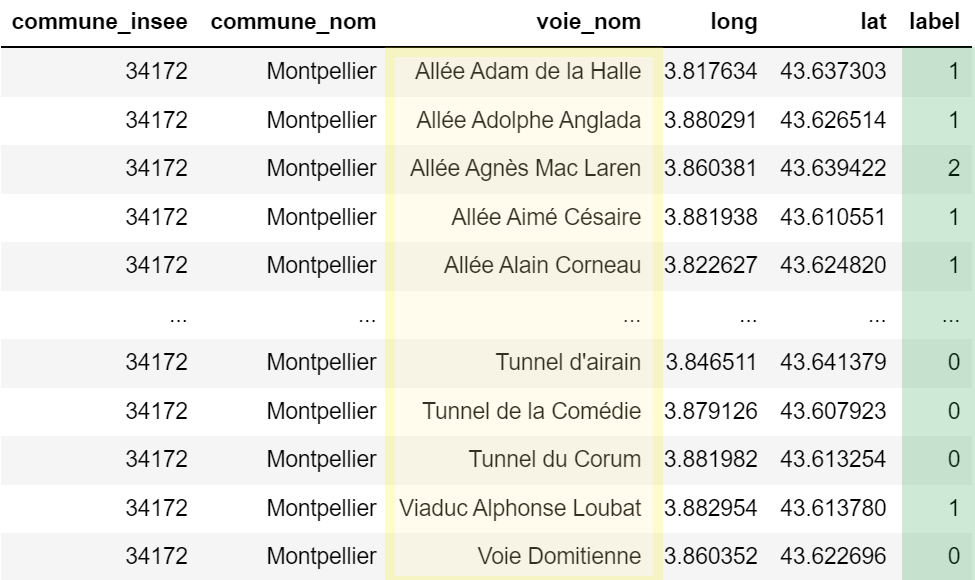

# NLP201 Street Names - Gender Analysis
NLP201 Frugal Innovation &amp; Computation Linguistics. Unit #9. Debias Language

# Contexte et objectif

Les noms des rues, des avenues, des jardins et chemins influencent nos représentations du monde.  Des associations et des médias ont souligné un problème de représentation, présent dans plusieurs villes: les femmes sont effacées de l'histoire avec des biais cognitifs associés (carrière scientifique, littéraire, entrepreneurial...). Add reference, source.
Des mairies et élus locaux se sont emparés du sujet, mais la parité, l'égalité est loin d'être atteinte.

<i> Hautement symbolique, la dénomination des rues et espaces publics est l’occasion de rendre hommage à des personnes célèbres, et notamment aux femmes. Depuis 2014, la proportion de voies parisiennes portant le nom d'une femme a doublé, atteignant 12% aujourd'hui.</i> - [Ville de Paris, 2021](https://www.paris.fr/pages/feminisons-les-noms-des-rues-6538#:~:text=Hautement%20symbolique%2C%20la%20d%C3%A9nomination%20des,atteignant%2012%25%20aujourd'hui)

Dans ce contexte, l'objectif du TD est d'utiliser de simple méthode de linguistique computationnelle pour mesurer le taux de représentation des femmes dans la dénomination des rues et espaces publics de la [Ville de Montpellier](https://www.data.gouv.fr/fr/datasets/base-adresse-locale-de-la-ville-de-montpellier/).
Il s'inscrit dans une démarche citoyenne et innovation sociale pour les acteurs publiques, élus locaux, associations et médias. Il s'appuyera sur [Matplotlib](https://matplotlib.org/), [Seaborn](https://seaborn.pydata.org/) et [Plotly](https://plotly.com/) pour la visualisation des données et résultats.

# Formulation du problème 

Étant donné une commune et son catalogue d'adresses (tableau à n=3136 lignes), prédire pour chaque adresse un label correspondant au genre de la personnalité (1 ou 2 s'il s'agit d'une personne, 0 sinon).

La solution sera évaluée contre d'autres méthodes heuristiques et par sa proximité globale (% rues et espaces publics avec un nom de femme et valeur absolue) 

# Installation 

Cloner ce projet avec `git clone`

Créer un environnement Python 3.8+, par exemple avec Anaconda `conda create -n miashs python=3.8`

Activater l'environment créé avec `activate miashs` et installer les dépendances avec `pip install -r requirements`

# Assignment

Completer les blocks marqués TODO dans `notebook/homework.ipynb`. En bonus, vous pouvez contribuer au projet (voir section Contribuer dessous).

# Résultats 

Ajouter notebooks, stats...

## Analyse linguistique

## Analyse geospatial

## Analyse par type de voie

# Contribuer

## Étendre à de nouveaux jeux de données

Étendre le jeu de données à de nouvelles communes, villes et comparer Montpellier à Paris ou Toulouse. Des données en accès libre sont répertoriés sur [data.gouv.fr](https://www.data.gouv.fr/fr/)

Étendre l'idée à l'étude des noms des écoles, des monuments, etc

## Améliorer le modèle 

L'approche proposée utilise des règles simples et peut être améliorée en précisant le champ domain knowledge dans `notebook/homework.ipynb` (stopwords, extra_names_f, extra_names_m), avec du pattern matching, regex, etc.

## Co-construire avec les parties prenantes

Dataviz, story telling, design, co-creation.

## CI / CD

Lint, flake, black, test code

On pull/push, merge, pull requests, etc
