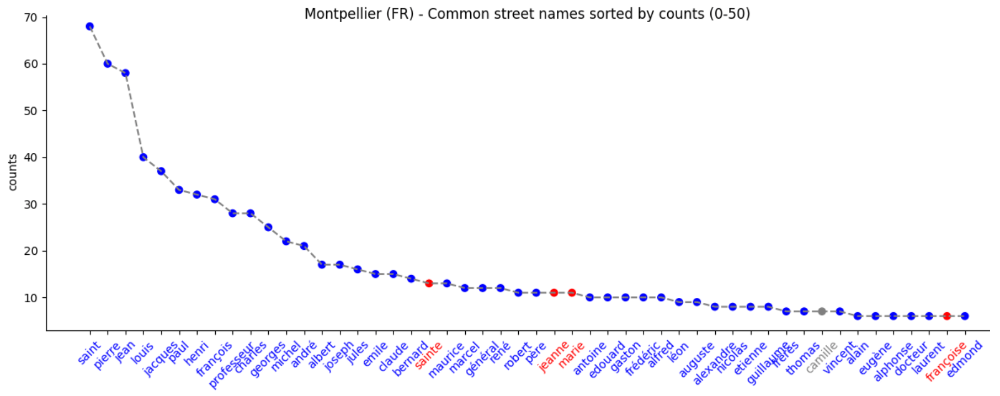
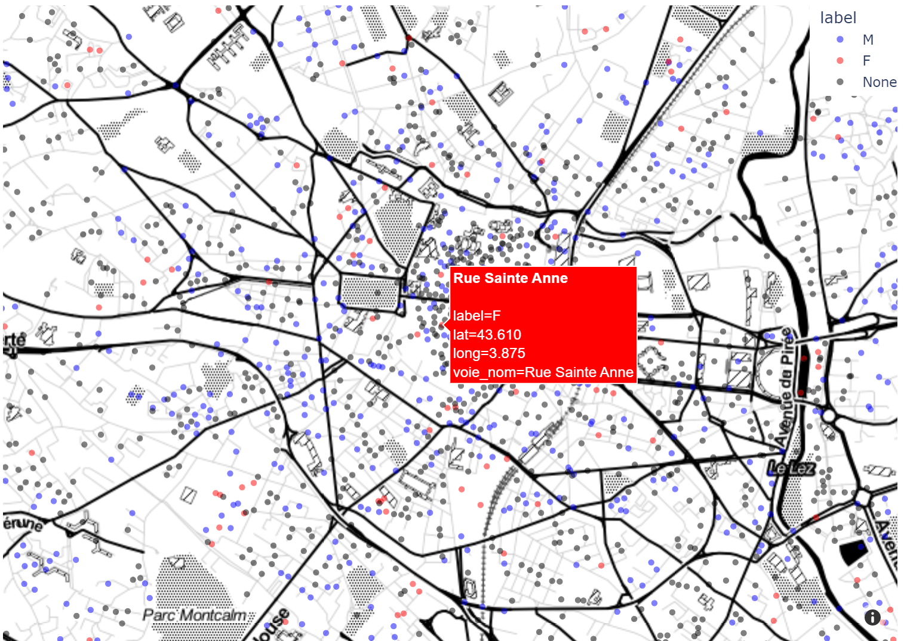
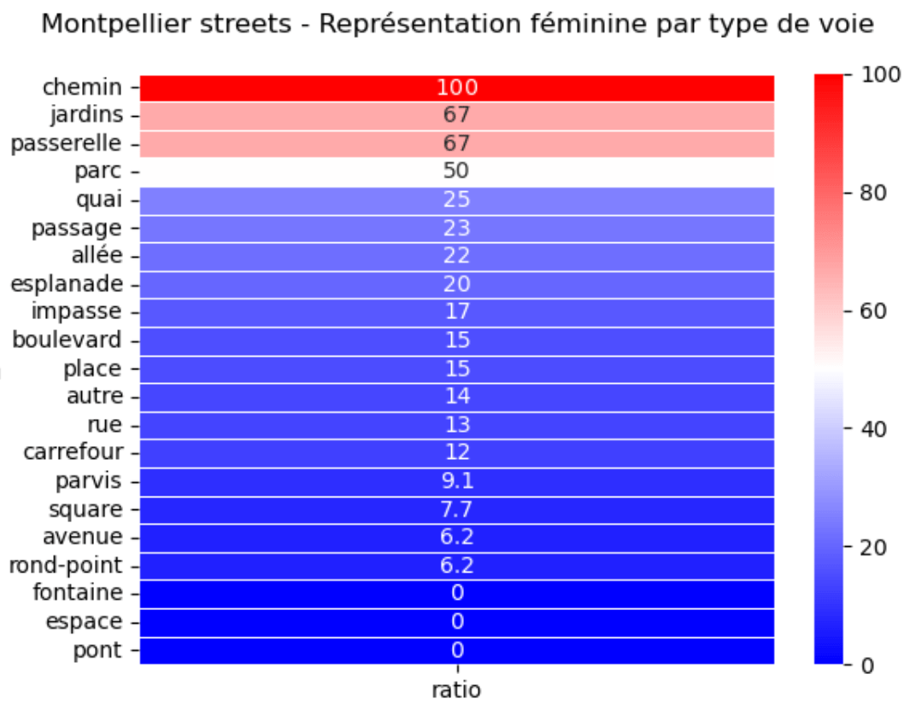
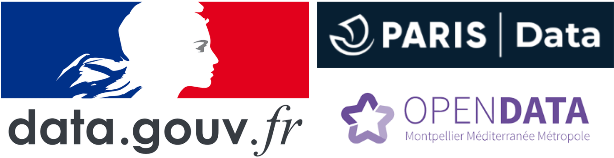

# NLP201 Street Names - Gender Analysis
NLP201 Frugal Innovation &amp; Computation Linguistics. Unit #9. Debias Language

# Contexte et objectif

Les noms des rues, des avenues, des jardins et chemins influencent nos représentations du monde et structurent nos imaginaires. Des maires et élus locaux se sont emparés du sujet, mais la parité, l'égalité est loin d'être atteinte.

<i> Hautement symbolique, la dénomination des rues et espaces publics est l’occasion de rendre hommage à des personnes célèbres, et notamment aux femmes. Depuis 2014, la proportion de voies parisiennes portant le nom d'une femme a doublé, atteignant 12% aujourd'hui.</i> - [Ville de Paris, 2021](https://www.paris.fr/pages/feminisons-les-noms-des-rues-6538#:~:text=Hautement%20symbolique%2C%20la%20d%C3%A9nomination%20des,atteignant%2012%25%20aujourd'hui)

Dans ce contexte, l'objectif du TD est d'utiliser de simples méthodes de linguistique computationnelle pour <b>estimer le taux de représentation des femmes dans la dénomination des rues et espaces publics</b> de la [Ville de Montpellier](https://www.data.gouv.fr/fr/datasets/base-adresse-locale-de-la-ville-de-montpellier/). Pour cela, on dispose d'un [catalogue d'addresses et noms de voie à Montpellier](https://www.data.gouv.fr/fr/datasets/base-adresse-locale-de-la-ville-de-montpellier/), ainsi qu'une liste de +10k prénoms et genres en accès-libre, publiés par [data.gouv.fr](https://www.data.gouv.fr/fr/datasets/liste-de-prenoms/). Le TD s'inscrit dans une démarche citoyenne et d'innovation sociale pour les acteurs publiques, élus locaux et associations. Il s'appuyera sur [Matplotlib](https://matplotlib.org/), [Seaborn](https://seaborn.pydata.org/) et [Plotly](https://plotly.com/) pour la visualisation des données et l'interprétation des résultats.

# Installation 

Cloner ce projet avec `git clone`

Créer un environnement Python 3.8+, par exemple avec Anaconda `conda create -n miashs python=3.8`

Activer l'environment créé avec `activate miashs` et installer les dépendances avec `pip install -r requirements.txt` or `conda install --file requirements.txt`

# Assignment

Completer les 5 blocks marqués TODO dans `notebook/homework.ipynb` et comparer les résultats à ceux reportés ci-dessous. En bonus, vous pouvez contribuer au projet (voir section Contribuer ci-dessous).

# Résultats 

## 1. Analyse linguistique

Sur 3371 mots trouvés dans les noms des voies (hors mots de liaison, type de voie), 86% n'apparaissent qu'une seule fois. Les 452 mots qui apparaissent à de multiples endroits contiennent des prénoms genrés comme "Marie" (en rouge) ou "Pierre" (en bleu). On observe que parmi les 50 prenoms les plus courants dans les noms des voies, 4 sont des femmes et parmi le top 100 ce sont 12 femmes, soit respectivement <b>8%</b> et <b>12%</b>.

## 2. Analyse geospatial

Sur [3136 voies]((https://www.data.gouv.fr/fr/datasets/base-adresse-locale-de-la-ville-de-montpellier/)) à Montpellier:

- 201 sont labellisées noms féminins vs 1138 masculins, soit <b>15%</b>
- 13 mentionnent une sainte (ex: <i>Ste Genevieve</i>) vs 68 un saint (ex: <i>St Pierre</i>), soit <b>16%</b>

## 3. Analyse par type de voie

La représentation des femmes varie fortement d'un type de voie à un autre. On observe que les chemin, jardins, passerelle sont à forte tendance féminine alors que les ponts, les rond-points, les avenues et les boulevards sont à forte tendance masculine. Sur 21 types de voie choisis aléatoirement, 3 sont à forte tendance féminine soit <b>14%</b>.

## 4. Résumé des indicateurs proposés

| Commune |    Année | Représentativité F/M | Méthode |
|----------|:--------:|---:| ------:|
| Montpellier |  2022 | 8% | [Top50 prenoms](https://github.com/MichelDeudon/nlp201-street-names-gender-analysis#1-analyse-linguistique) |
| Montpellier |  2022 | 12% | [Top100 prenoms](https://github.com/MichelDeudon/nlp201-street-names-gender-analysis#1-analyse-linguistique) |
| Montpellier |  2022 | 14% | [Types de voie](https://github.com/MichelDeudon/nlp201-street-names-gender-analysis#3-analyse-par-type-de-voie) |
| Montpellier |  2022 | 15% | [# Voies](https://github.com/MichelDeudon/nlp201-street-names-gender-analysis#2-analyse-geospatial) |
| Montpellier |  2022 | 16% | [# Voies saint.e](https://github.com/MichelDeudon/nlp201-street-names-gender-analysis#2-analyse-geospatial) |
| Montpellier |  2022 | 12% ± 4% | Ensemble |

Les résultats obtenus par de simples méthodes de linguistique computationnelle sur la [Ville de Montpellier](https://www.data.gouv.fr/fr/datasets/base-adresse-locale-de-la-ville-de-montpellier/) en 2022 sont cohérents avec un ratio de 12% communiqué par [lamarseillaise.fr](https://www.lamarseillaise.fr/societe/la-ville-de-montpellier-honore-les-femmes-dans-l-espace-public-NC7260924) et [lejournaltoulousain.fr](https://www.lejournaltoulousain.fr/occitanie/montpellier-12-nouvelles-rues-porteront-des-noms-de-femmes-117636/) en 2021 et similaire au ratio de la [ville de Paris](https://www.paris.fr/pages/feminisons-les-noms-des-rues-6538#:~:text=Hautement%20symbolique%2C%20la%20d%C3%A9nomination%20des,atteignant%2012%25%20aujourd'hui). Ces méthodes peuvent être utilisées pour estimer et comparer, dans de nouvelles communes, le taux de représentation des femmes dans la dénomination des rues et espaces publics.

# Contribuer

Le jeu de données utilisé peut-être étendu à de nouvelles communes ou pour étudier la distribution des noms des écoles, des monuments, etc. Des données en accès libre sont répertoriées sur [data.gouv.fr](https://www.data.gouv.fr/fr/).

Certaines des méthodes proposées peuvent être améliorées en précisant le champ domain knowledge dans `notebook/homework.ipynb` (stopwords, extra_names_f, extra_names_m), avec du pattern matching, etc.

Enfin, la co-construction avec les parties prenantes, la data visualisation et le story telling peuvent aider pour sensibiliser les élus locaux ou citoyens sur le sujet et faire évoluer le taux de représentation des femmes dans la dénomination des rues et espaces publics.

# Remerciements

